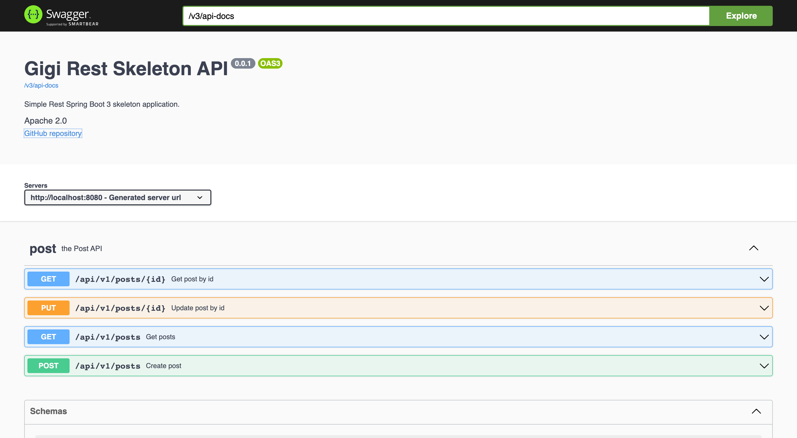
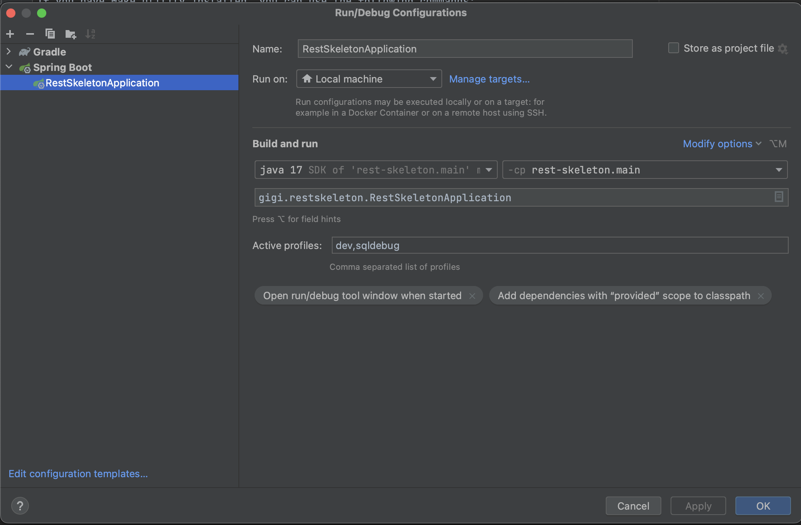
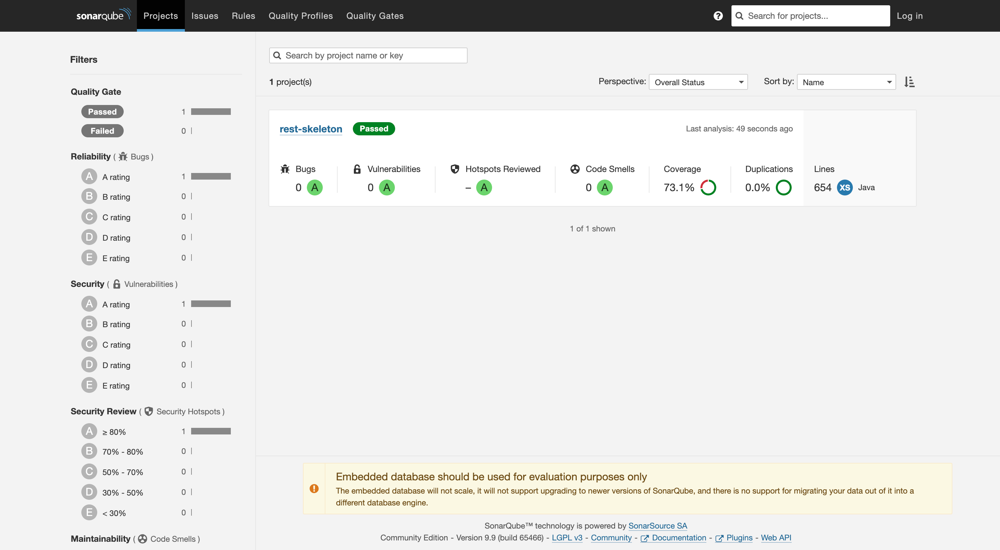
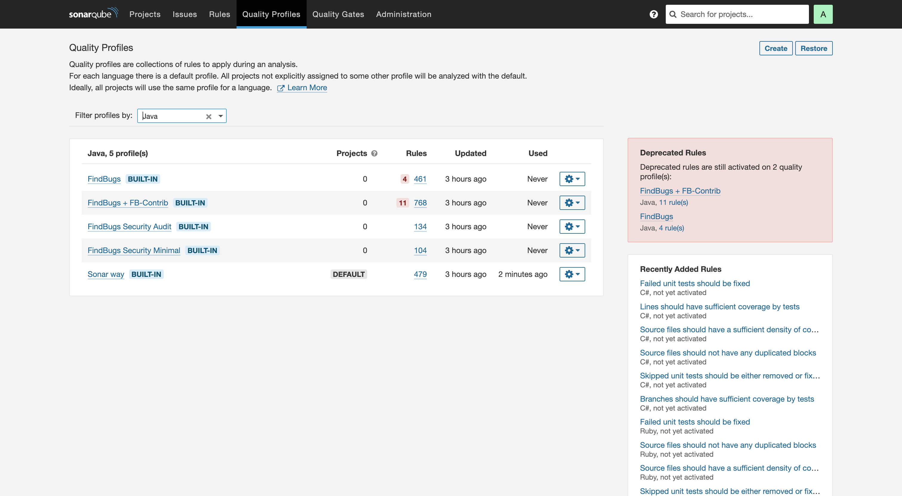

# Spring Boot 3 REST API skeleton

This is a skeleton REST API template project for Spring Boot 3.

Yet another attempt to combine the newest tech stack with a clean architecture.

This project can be used as a starting point for new projects, or as a reference for any Spring Boot 3 based projects.

## Table of contents
<!-- TOC -->
  * [What's included](#whats-included)
  * [Requirements](#requirements)
  * [Quick start](#quick-start)
  * [Overview](#overview)
    * [Local development](#local-development)
    * [Data model and domain](#data-model-and-domain)
    * [Migrations](#migrations)
    * [Problem Details for HTTP APIs (RFC7807)](#problem-details-for-http-apis--rfc7807-)
    * [Code analysis](#code-analysis)
    * [SonarQube](#sonarqube)
    * [Testing](#testing)
    * [Live restart](#live-restart)
    * [Code formatting](#code-formatting)
    * [Production build](#production-build)
  * [TODO](#todo)
<!-- TOC -->

> **Note:**
> I recommend using Spring Boot 2.7.x for new enterprise projects as of March 2023.
> Spring Boot 2.7.x has more stable dependencies and more relevant examples
> available online, especially for working with JPA and Hibernate 6. This is based on my personal experience working
> with
> this skeleton.

## What's included

- [Spring Boot 3.1.1](https://spring.io/projects/spring-boot)
- [Gradle 8.1.1](https://gradle.org/)
- [PostgreSQL 15](https://www.postgresql.org/) in Docker for local development
- [Spring Data JPA](https://docs.spring.io/spring-data/jpa/docs/current/reference/html/) as data layer
- [Spring MVC](https://docs.spring.io/spring-boot/docs/current/reference/htmlsingle/#web) for building REST API
- [Liquibase 4.18.0 ](https://www.liquibase.org/) for database migrations
- [MapStruct 1.5.3](https://mapstruct.org/) for mapping data between layers
- [Actuator](https://docs.spring.io/spring-boot/docs/current/reference/html/actuator.html) for
  monitoring and management
- [SonarQube 9.9 LTS](https://www.sonarsource.com/products/sonarqube/downloads/lts/9-9-lts/) in Dockerfile
  with [FindBugs plugin](https://github.com/spotbugs/sonar-findbugs) installed for local code analysis
- [Lombok](https://projectlombok.org/) for reducing boilerplate code
- [Jacoco Plugin](https://docs.gradle.org/current/userguide/jacoco_plugin.html) for code coverage
- [Spotbugs Plugin](https://github.com/spotbugs/spotbugs-gradle-plugin#readme) for static code analysis
- [SpringDoc OpenApi v2](https://springdoc.org/v2/) for API documentation
- [Spotless Plugin](https://github.com/diffplug/spotless/tree/main/plugin-gradle#google-java-format)
  with [google-java-format](https://github.com/google/google-java-format) enabled for code formatting
- [Spring Boot DevTools](https://docs.spring.io/spring-boot/docs/current/reference/html/using-spring-boot.html#using-boot-devtools)
  for live restart
- [Testcontainers](https://www.testcontainers.org/) for integration tests

See full list of actual dependencies in [build.gradle](build.gradle) file.

## Requirements

- Java Development Kit 17 (for
  example [Amazon Corretto](https://docs.aws.amazon.com/corretto/latest/corretto-17-ug/downloads-list.html)
  or [Liberica JDK](https://bell-sw.com/pages/downloads/#/java-17-lts))
- [Docker](https://www.docker.com/) for local development and testing
- Make utility for your system (optional)

## Quick start

Clone this repository

```bash
git clone https://github.com/gigi/gigi-spring-rest-skeleton && cd ./gigi-spring-rest-skeleton
```

If you have Make utility installed, you can use the following commands:

```bash
make run
```

Alternatively, you can use the following command:

```bash
docker-compose up -d postgres && ./gradlew bootRun --args='--spring.profiles.active=dev,sqldebug'
```

This command will start PostgreSQL 15 using docker-compose.yaml file, build the application and run it on
port 8080. Default credentials will be used (postgres:postgres/postgres).

`dev` and `sqldebug` profiles enables Spring Boot Actuator endpoints, SQL debug logging and expose Swagger endpoint.

After start, you can find the API documentation at http://localhost:8080/docs/swagger-ui/index.html.





If you are using IntelliJ IDEA, add profiles `dev` and `sqldebug` to the `Active profiles` field in
the `Run/Debug Configurations` window.



## Overview

Application shows one of the possible ways to organize a Spring Boot 3 REST API project. API allows users to
create/read/update posts, and
add tags for these posts. 
The list of posts can be paginated for easier navigation.

### Local development

Use docker-compose to start dependencies for local development:

```bash
make up
```

or

```bash
./gradlew composeUp
```

or just

```bash
docker-compose up
```

To shut down dependencies when the work is finished:

```bash
make down
```

or

```bash
./gradlew composeDown
```

or

```bash
docker-compose down
```

> **Warning:**
> Gradle Docker Compose plugin has issues with container naming so use only one way to start/stop containers.
> 
> See https://github.com/avast/gradle-docker-compose-plugin/issues/372 for more information.

### Data model and domain

The layers in this application are separated from each other, with each layer having its own entities and mappers.

For demonstration purposes, the application uses simple [Domain entities](src/main/java/gigi/restskeleton/model/domain):
Post and Author represented as Java Records.

Post has a relation to Author just to showcase the potential of the MapStruct mapper. If you are a true DDD fan, it is recommended to use just the
AuthorID reference inside the Post aggregate.

The corresponding [JPA entities](src/main/java/gigi/restskeleton/model/orm) are used only to access data and perform
database migrations.

If you don't need to extract pure domain or hate DDD, you can rely solely on JPA classes as a domain layer. It is a
common compromise for many projects.

However, it is recommended to stick to immutable entities as much as possible. At the very least, make the public
constructor private. Create an all-arguments constructor and avoid using setters. Hibernate will take care of the rest.

The JPA specification itself is not compatible with the classic DDD approach. For more information, please
see https://www.baeldung.com/spring-persisting-ddd-aggregates.

The service layer exposes to controller only domain entities, not JPA entities.
See [ModelMapper](src/main/java/gigi/restskeleton/model/service/ModelMapper.java).

The presentation layer uses its own mapper to convert business entities to [Responses](src/main/java/gigi/restskeleton/api/v1/response).
See [ResponseMapper](src/main/java/gigi/restskeleton/api/v1/ResponseMapper.java)

### Migrations

Migrations are performed using [Liquibase](https://www.liquibase.org/) and applied on application startup.
To create new migration after changing JPA entities against default connected database run:

```bash
make migration
```

or

```bash
./gradlew diffChangelog
```

SQL migration will be created in [src/main/resources/db/migrations](src/main/resources/db/migrations) folder and named according to current time.

By default, credentials from [src/main/resources/application.properties](src/main/resources/application.properties) will
be used.
See liquibase task in [build.gradle](build.gradle) file for more details.

> **Warning:**
> Do not update liquibase to newer version. It has issues with alter statements. Wait for fix.

### Problem Details for HTTP APIs (RFC7807)

Spring Boot 3 introduces support of [RFC7807](https://datatracker.ietf.org/doc/html/rfc7807) for REST API error
responses.
This skeleton extends this functionality with custom error codes. 
For validation errors additional property `violations` added with [422 Unprocessable Entity](https://developer.mozilla.org/en-US/docs/Web/HTTP/Status/422)
status code.

See [GlobalExceptionHandler.java](src/main/java/gigi/restskeleton/api/v1/controller/GlobalExceptionHandler.java)

### Code analysis

Spotbugs and SonarQube are used for code analysis.

The Spotbugs task is configured to run automatically on every build against main and test source sets.

[Filter](findbugs-exclude-filter.xml) excludes bugs `EI_EXPOSE_REP` and `EI_EXPOSE_REP2,MS_EXPOSE_REP` from analysis.

### SonarQube

SonarQube is a static code analysis tool. It can be used to detect bugs, vulnerabilities and code smells in your code.
It can also measure and track your technical debt.

To analyze the code start SonarQube server from the the docker-compose.yaml file `docker-compose up sonarqube` (if not run yet) then run:

```bash
./gradlew sonar
```

This command will analyze the code against `Sonar way` quality profile and collect the code coverage. Default `admin:admin`
credentials are used.

To see the results, open http://localhost:9000 in your browser.



You can change the Quality Profile to Findbugs:

For more information see https://www.sonarsource.com/products/sonarqube/

### Testing

Integration and unit tests run together. To run tests use:

```bash
make test
```

or

```bash
./gradlew test
```

Integration tests rely on [Testcontainers](https://www.testcontainers.org/) library.
Use [AbstractDataSourceTest.java](src/test/java/gigi/restskeleton/AbstractDataSourceTest.java)
as starting point. Extend this class with your integration test class (use [PostRepositoryTest.java](src/test/java/gigi/restskeleton/model/repository/PostRepositoryTest.java) as example).

### Live restart

If you use IntelliJ IDEA, you may configure automatic restart of the application after code changes. 
For `2022` and newer versions of IntelliJ IDEA,
open settings and go to `Build, Execution, Deployment > Compiler > Build project automatically`. Check the box. 

Then go to `Advanced Settings, Compiler > Allow auto-make to start even if developed application is currently running`. Check the box.

For more information see https://docs.spring.io/spring-boot/docs/current/reference/html/using.html#using.devtools.restart

### Code formatting

To format the code according to [Google Java Style Guide](https://google.github.io/styleguide/javaguide.html) run:

```bash
./gradlew spotlessApply
```

### Production build

If you want to deploy your application to production using docker, you can build a docker image with this command:

```bash
make docker
```

or

```bash
./gradlew clean bootJar && docker build -t gigi/gigi-spring-rest-skeleton:latest .
```

The docker image will be built using [azul/zulu-openjdk-alpine:17-jre](https://hub.docker.com/r/azul/zulu-openjdk-alpine/tags).
If the image size matters, use jlink to create a custom runtime image.

For more information about containerized java applications please follow:
- https://thecattlecrew.net/2022/11/07/preparing-for-spring-boot-3-choose-the-right-java-17-base-image/
- https://badass-jlink-plugin.beryx.org/releases/latest/

## TODO

- [ ] Add GitHub CI
- [ ] Add Spring Security for demonstration purposes
- [ ] Update Liquibase when unnecessary alter statements issue will be fixed (https://github.com/liquibase/liquibase/issues/4047)
- [ ] Update Gradle to 8.1 when it will be released and tested with Spring Boot 3
- [ ] Obtain key for SonarQube instead of password usage
- [ ] Separate unit and integration tests